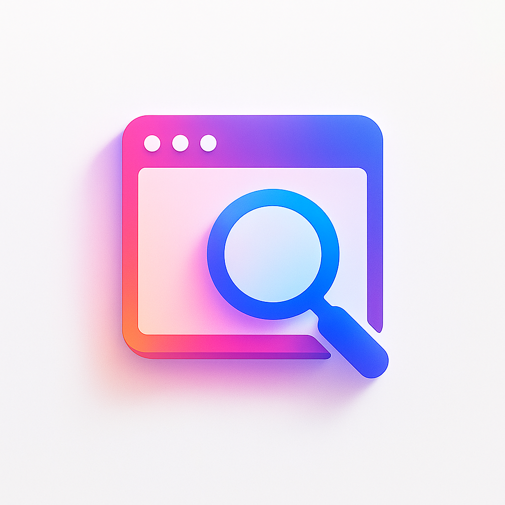

<h1 align="center" style="display: block; font-size: 2.5em; font-weight: bold; margin-block-start: 1em; margin-block-end: 1em;">
  
    
  <strong>URL-INSPECTOR</strong>
</h1>

  <em>URL Inspector — это сервис для анализа и проверки ссылок. 
  Он позволяет получать <b>HTTP статус-коды</b>, проверять <b>SSL</b>, отслеживать <b>редиректы</b>, 
  извлекать <b>заголовки и мета-теги</b>, а также сохранять результаты в <b>MongoDB</b>.</em>

## 📑 Содержание
- ⚡️ [Быстрый старт](#️-быстрый-старт)
- 🐳 [Docker](#-docker)
- 🛠 [Стек технологий](#-стек-технологий)
- 🚀 [Функциональность](#-функциональность)
- 📂 [Архитектура проекта](#-архитектура-проекта)
- 📌 [Примеры использования](#-примеры-использования)
- ✅ [TODO](#-todo)

---

