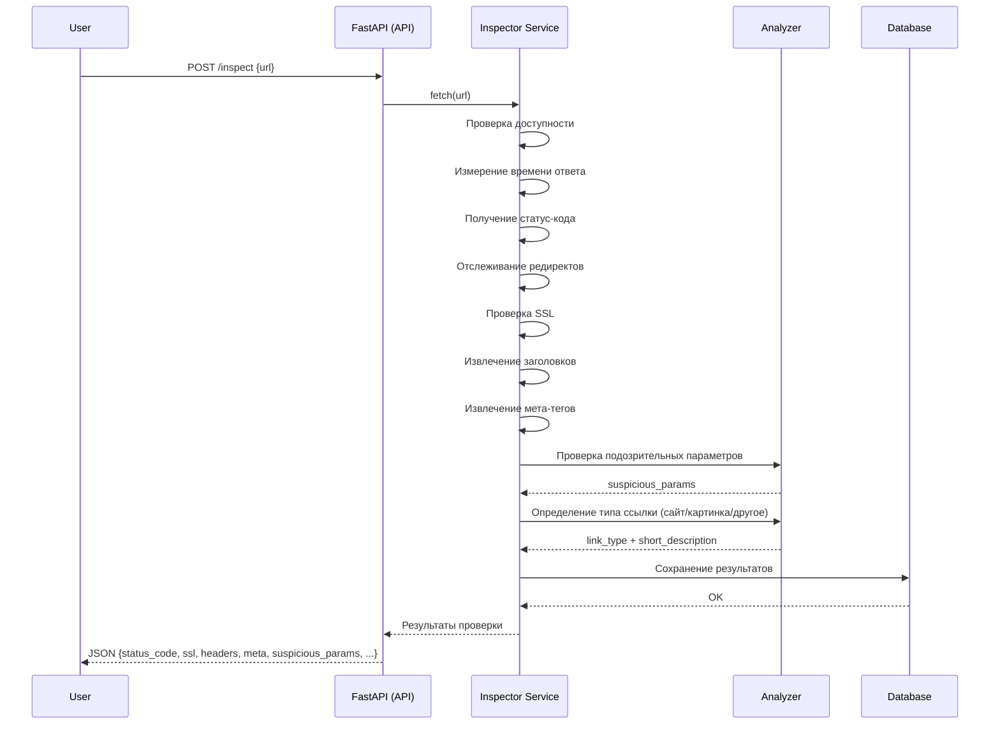

# fastapi-url-inspector-documentation

```mermaid
sequenceDiagram
    participant User
    participant API as FastAPI (API)
    participant Inspector as Inspector Service
    participant Analyzer as Analyzer
    participant DB as Database

    User->>API: POST /inspect {url}
    API->>Inspector: fetch(url)
    Inspector->>Inspector: Проверка доступности
    Inspector->>Inspector: Измерение времени ответа
    Inspector->>Inspector: Получение статус-кода
    Inspector->>Inspector: Отслеживание редиректов
    Inspector->>Inspector: Проверка SSL
    Inspector->>Inspector: Извлечение заголовков
    Inspector->>Inspector: Извлечение мета-тегов
    Inspector->>Analyzer: Проверка подозрительных параметров
    Analyzer-->>Inspector: suspicious_params
    Inspector->>Analyzer: Определение типа ссылки (сайт/картинка/другое)
    Analyzer-->>Inspector: link_type + short_description
    Inspector->>DB: Сохранение результатов
    DB-->>Inspector: OK
    Inspector-->>API: Результаты проверки
    API-->>User: JSON {status_code, ssl, headers, meta, suspicious_params, ...}

```
